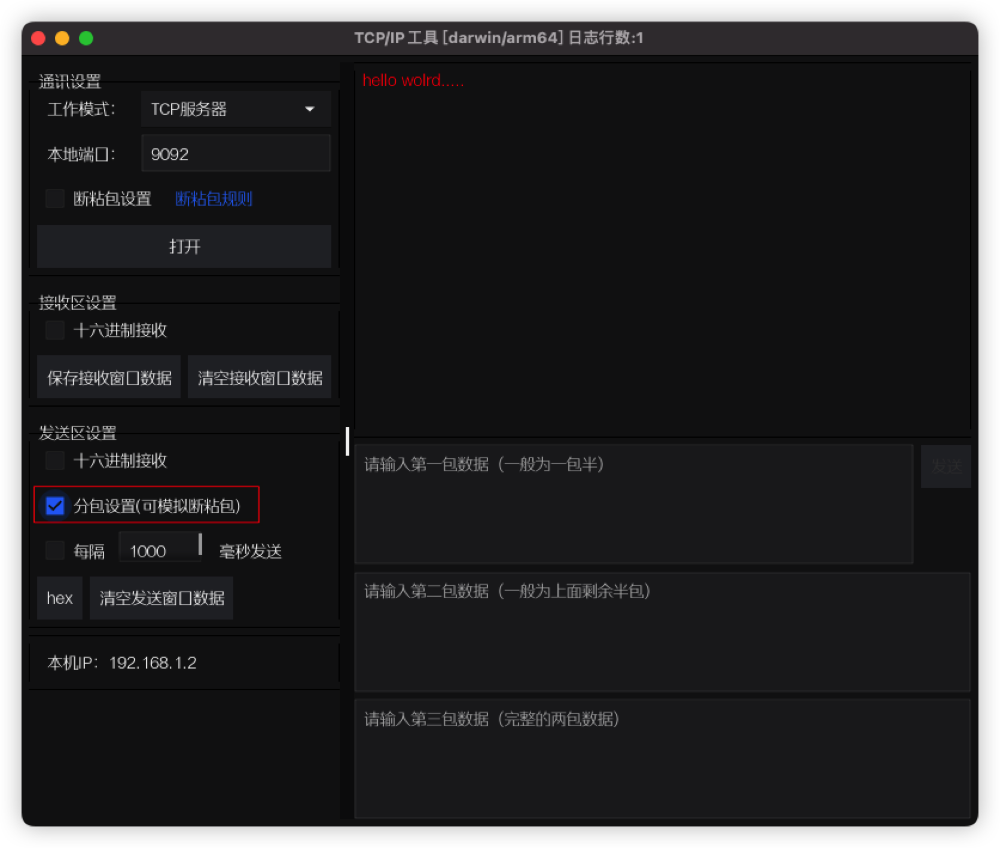

# tcp调试工具
一款tcp调试工具，gui基于fyne，tcp框架基于[zinx](https://github.com/aceld/zinx)


[tcptestv.0.0.1下载](https://github.com/xxl6097/tcptest/releases/tag/v0.0.0)


## 安装过程

### 1 安装`fyne-cross`和`fyne`工具

```bash
go install github.com/fyne-io/fyne-cross@latest
```

```bash
go install fyne.io/fyne/v2/cmd/fyne@latest
```

### 2 交叉编译

```bash
$ bash build.sh 
1. 编译 Windows
2. 编译 MacOS
3. 编译 Android
4. 编译全平台
请输入编号:
2
```

> ***注意***： 要求go version 1.18+

选择要编译的平台，编译完成后会在`dist`目录下生成对应的可执行文件`tcptest`。


## TCP客户端模式使用说明


[](客户端模式)

### 通讯设置

* 工作模式：客户端模式请选择 'TCP客户端'
* 目的IP：目的Server的IP地址
* 目的端口：目的Server的端口号

### 接收区设置

* 十六进制接收：将接收到的字节数字以十六进制字符串显示

### 发送区域设置

* 十六进制发送：在发送输入框输入十六进制的字符串数据
* 分包设置，下面再详细解释👇
* 每隔xxx毫秒发送：启动一个协程循环发送输入框的数据


#### 分包设置

启用分包设置后，会出现三个发送输入框，一次发送请求会获取三个输入框内容顺序发送。
一般情况下，只需要<font color='red'>三包数据</font>即可模拟断粘包的情况

[](客户端模式)


## TCP服务器模式使用说明


[](客户端模式)

### 通讯设置

这里的设置，主要说明断粘包设置，规则请点击'[断粘包规则](https://netty.io/4.0/api/io/netty/handler/codec/LengthFieldBasedFrameDecoder.html)'超连接