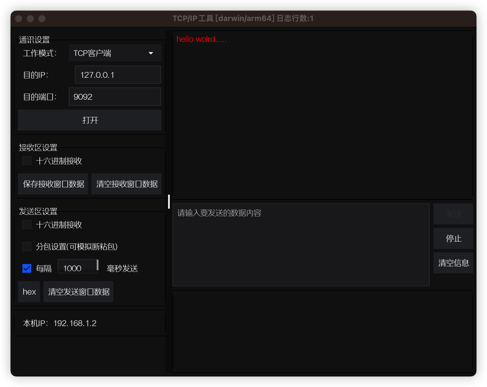
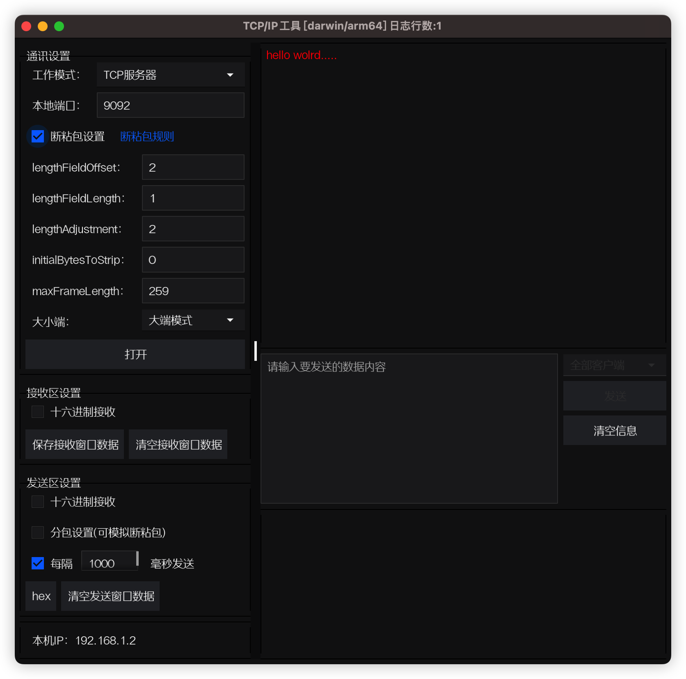

# tcp调试工具
一款tcp调试工具，gui基于fyne，tcp框架基于[zinx](https://github.com/aceld/zinx)


[tcptestv.0.0.1下载](https://github.com/xxl6097/tcptest/releases/tag/v0.0.0)


## 安装过程

### 1 安装`fyne-cross`和`fyne`工具

```bash
go install github.com/fyne-io/fyne-cross@latest
```

```bash
go install fyne.io/fyne/v2/cmd/fyne@latest
```

### 2 交叉编译

```bash
$ bash build.sh 
1. 编译 Windows
2. 编译 MacOS
3. 编译 Android
4. 编译全平台
请输入编号:
2
```

> ***注意***： 要求go version 1.18+

选择要编译的平台，编译完成后会在`dist`目录下生成对应的可执行文件`tcptest`。


## TCP客户端模式使用说明


[](客户端模式)


## TCP服务器模式使用说明


[](客户端模式)